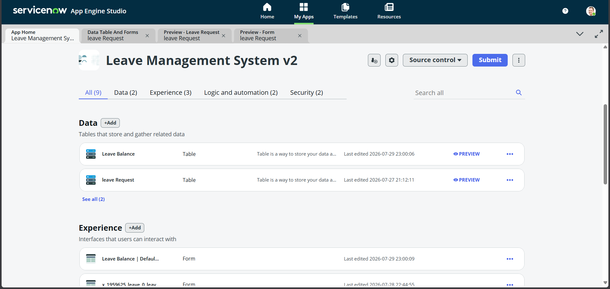
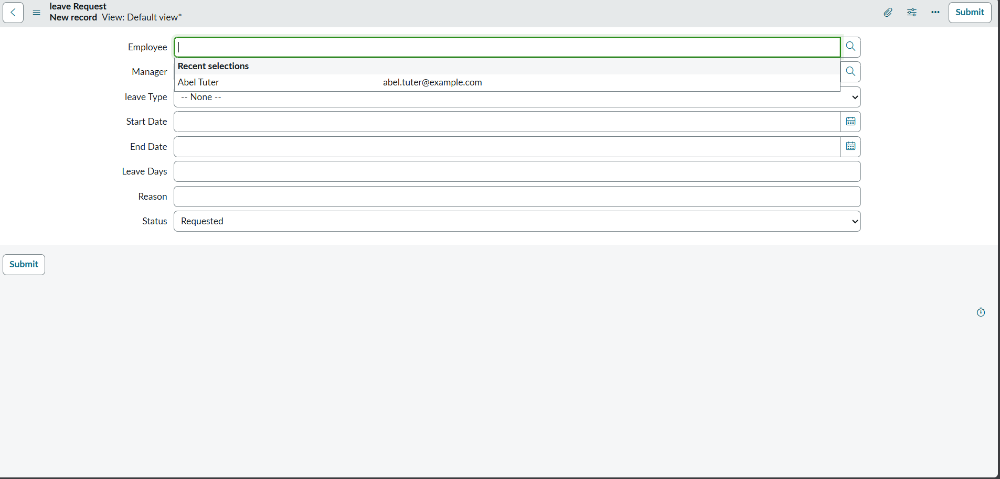
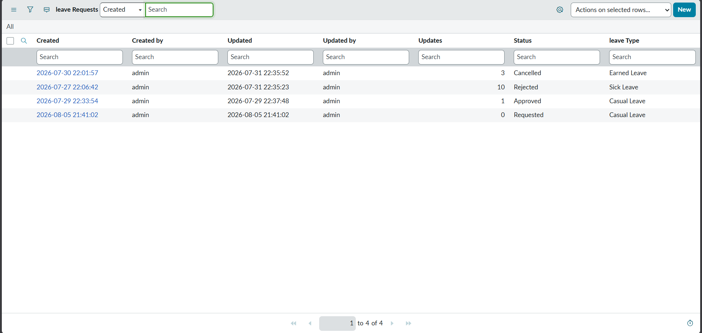
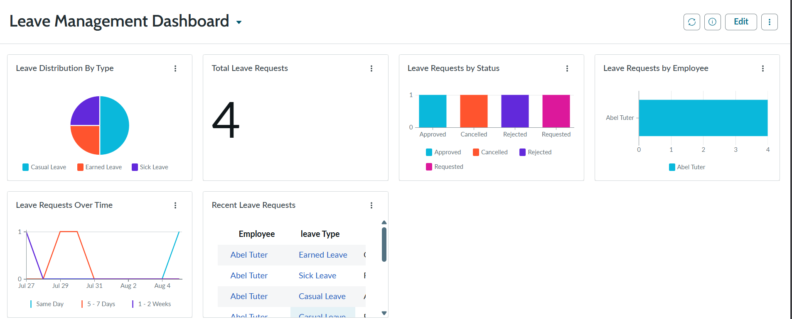
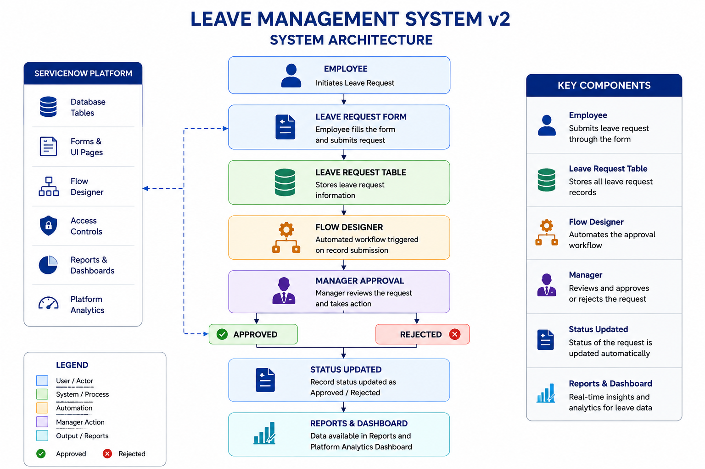
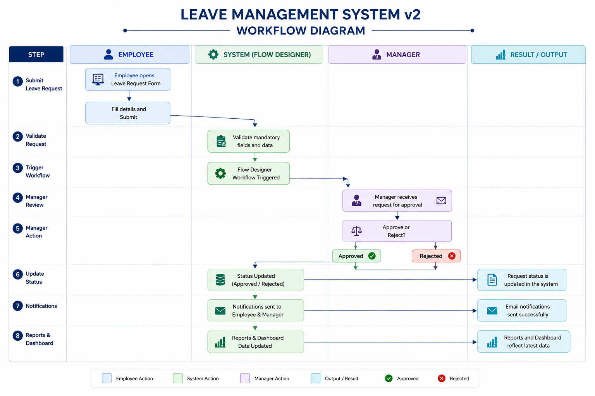

A ServiceNow workflow automation project for employee leave management using Flow Designer and Platform Analytics.
# 🚀 Leave Management System using ServiceNow

A workflow automation project developed using **ServiceNow App Engine Studio**, **Flow Designer**, and **Platform Analytics** to automate employee leave requests and manager approvals.

---

# 📌 Project Overview

The Leave Management System is a custom ServiceNow application that automates the leave request process. Employees can submit leave requests, managers can approve or reject them, and administrators can monitor requests using an interactive dashboard.

---

# ✨ Features

- ✅ Employee Leave Request Form
- ✅ Manager Approval Workflow
- ✅ Leave Status Tracking
- ✅ Flow Designer Automation
- ✅ Platform Analytics Dashboard
- ✅ Reports & Analytics
- ✅ Recent Leave Requests
- ✅ Employee-wise Leave Analysis
- ✅ Leave Type Distribution
- ✅ Leave Trend Analysis

---

# 🛠️ Technologies Used

- ServiceNow
- App Engine Studio
- Flow Designer
- Platform Analytics
- Reports
- Dashboards
- Custom Tables

---

# 🔄 Workflow

Employee
⬇️

Submit Leave Request

⬇️

Flow Designer Trigger

⬇️

Manager Approval

⬇️

Approved / Rejected

⬇️

Status Updated Automatically

⬇️

Dashboard & Reports Updated

---

# 📊 Dashboard Components

- 📌 Leave Distribution by Type (Pie Chart)
- 📌 Total Leave Requests (Single Score)
- 📌 Leave Requests by Status (Bar Chart)
- 📌 Leave Requests by Employee (Horizontal Bar)
- 📌 Leave Requests Over Time (Line Chart)
- 📌 Recent Leave Requests (List)

---

# 📂 Project Structure

```text
Leave Management System
│
├── Leave Request Form
├── Custom Table
├── Flow Designer
├── Reports
├── Dashboard
└── Platform Analytics
```

---

# 🎯 Business Rules

- Employee submits leave request.
- Flow Designer triggers automatically.
- Manager reviews the request.
- Manager approves or rejects the request.
- Leave status updates automatically.
- Dashboard reflects the latest information.

---

## 📸 Screenshots

### App Engine Studio


### Leave Request Form


### Leave Request List


### Flow Designer


### Dashboard


### System Architecture


### Workflow Diagram

---

# 🚀 Future Enhancements

- Email Notifications
- Leave Balance Management
- Multi-Level Approval
- Holiday Calendar
- REST API Integration
- Mobile Support

---

# 💼 Resume Highlights

- Developed a custom Leave Management application using ServiceNow.
- Automated leave approval workflow using Flow Designer.
- Built Platform Analytics dashboards with multiple visualizations.
- Created reports for employee leave tracking and analysis.
- Improved workflow efficiency through automation.

---

# 👨‍💻 Author

**Gireesh**

ServiceNow Developer | Java | SQL | Platform Analytics | Workflow Automation

---
⭐ If you like this project, don't forget to star the repository!
